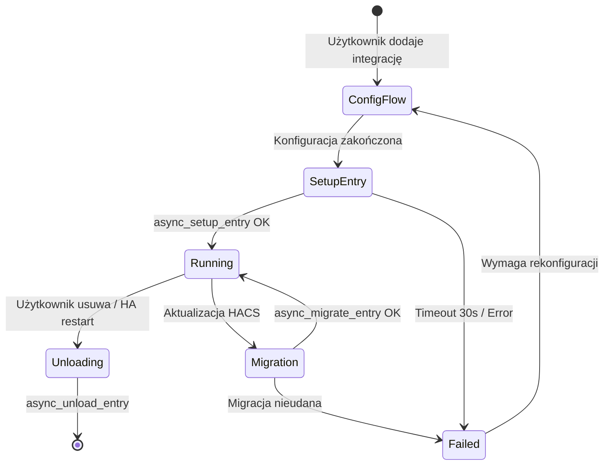
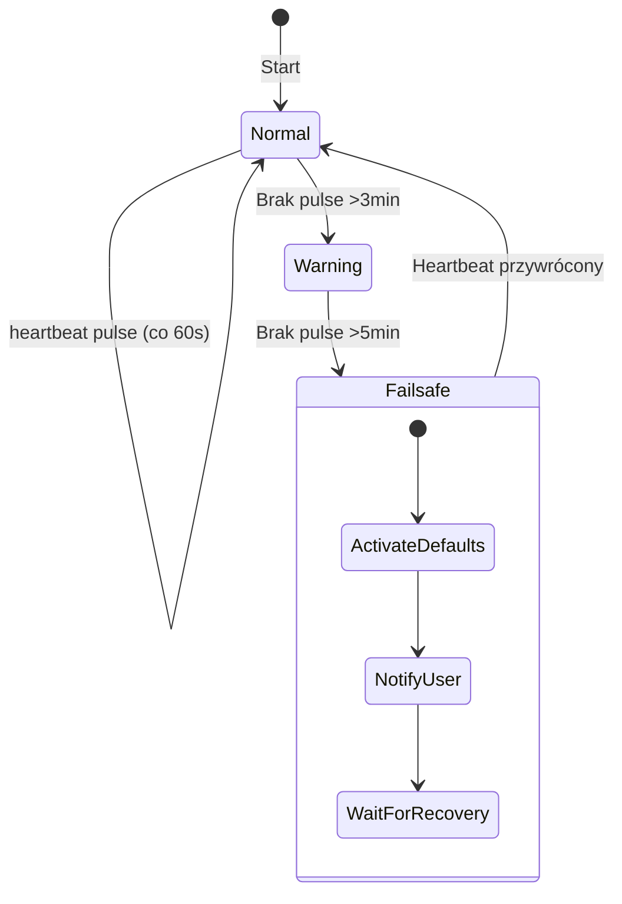

# Dokument Projektowy — Polish Energy Optimizer (PEO)

## Przegląd (Overview)

Polish Energy Optimizer (PEO) to niestandardowa integracja Home Assistant zaprojektowana jako modularna platforma optymalizacji energetycznej dla polskiego rynku. Integracja łączy sześć współpracujących modułów w spójny system, który pobiera ceny spot z RCE PSE, oblicza rzeczywiste koszty energii z uwzględnieniem polskich taryf i operatorów OSD, harmonogramuje ładowanie pojazdów elektrycznych, zarządza przesuwaniem obciążeń, optymalizuje autokonsumpcję PV z magazynem energii oraz analizuje opłacalność taryf.

### Kluczowe decyzje projektowe

1. **Architektura modularna z niezależnymi koordynatorami** — każdy moduł posiada własną instancję `DataUpdateCoordinator`, co zapewnia izolację awarii i niezależne cykle aktualizacji.
2. **Wzorzec Event-Driven** — moduły komunikują się przez zdarzenia HA (`peo_prices_updated`, `peo_schedule_updated`), co eliminuje bezpośrednie zależności cykliczne.
3. **Algorytm optymalizacji oparty na programowaniu liniowym** — harmonogramowanie EV i load shifting wykorzystują solver LP do minimalizacji kosztów przy ograniczeniach (moc przyłączeniowa, okna czasowe, priorytety).
4. **Separacja danych statycznych i dynamicznych** — stawki taryfowe i definicje stref w plikach JSON (aktualizowane z wersją integracji), parametry użytkownika w `ConfigEntry.options`.
5. **Język polski jako domyślny** — cały Config Flow, komunikaty błędów i powiadomienia w języku polskim.

### Kontekst konkurencyjny

Istniejące rozwiązania (RCE PSE, Energy Hub Poland, EMHASS) oferują fragmentaryczne funkcjonalności. PEO integruje je w jedno narzędzie:
- RCE PSE → tylko ceny spot, brak sterowania
- Energy Hub Poland → koszty taryfowe, brak optymalizacji
- EMHASS → optymalizacja, ale bez polskiego kontekstu i bez UI

## Architektura

### Diagram architektury wysokopoziomowej

```mermaid
graph TB
    subgraph "Home Assistant Core"
        HA_EventBus[Event Bus]
        HA_Services[Service Registry]
        HA_States[State Machine]
        HA_Config[ConfigEntry]
    end

    subgraph "PEO Integration"
        subgraph "Warstwa Koordynacji"
            PriceCoord[PriceDataCoordinator<br/>interval: 60min]
            TariffCoord[TariffDataCoordinator<br/>interval: 15min]
            PVCoord[PVForecastCoordinator<br/>interval: 60min]
        end

        subgraph "Moduły Logiki Biznesowej"
            ModulCen[Moduł_Cen<br/>Pobieranie cen RCE]
            KalkulatorTaryf[Kalkulator_Taryf<br/>Obliczanie kosztów]
            HarmonogramEV[Harmonogramownik_EV<br/>Scheduler ładowania]
            MenedzerObciazen[Menedżer_Obciążeń<br/>Load Shifting]
            OptymalizatorPV[Optymalizator_PV<br/>PV + Bateria]
            AnalizatorTaryf[Analizator_Taryf<br/>Porównanie taryf]
        end

        subgraph "Warstwa Danych"
            TariffDB[Tariff Definitions<br/>JSON files]
            PriceStore[Price History Store<br/>30 days]
            SessionStore[Session Store<br/>1000 sessions]
            ScheduleEngine[Schedule Engine<br/>LP Solver]
        end

        subgraph "Warstwa Komunikacji"
            RCE_Client[RCE PSE API Client]
            OCPP_Adapter[OCPP 1.6/2.0 Adapter]
            Tesla_Adapter[Tesla API Adapter]
            Wallbox_Adapter[Wallbox API Adapter]
            OpenEVSE_Adapter[OpenEVSE API Adapter]
            Solar_Client[Solar Forecast Client<br/>Solcast/Forecast.Solar/OWM]
        end

        subgraph "Warstwa Prezentacji"
            ConfigFlow[Config Flow<br/>Multi-step PL]
            OptionsFlow[Options Flow<br/>Per-module]
            Sensors[Sensor Platform]
            BinarySensors[Binary Sensor Platform]
            Services[Service Handlers]
        end
    end

    subgraph "Zewnętrzne API"
        PSE_API[PSE RCE API]
        Solcast_API[Solcast API]
        ForecastSolar_API[Forecast.Solar API]
        OWM_API[OpenWeatherMap Solar]
    end

    subgraph "Urządzenia"
        EV_Chargers[Ładowarki EV<br/>OCPP/Tesla/Wallbox/OpenEVSE]
        Inverters[Inwertery PV<br/>SolarEdge/Huawei/GoodWe/Fronius/SMA]
        Loads[Odbiorniki<br/>Bojler/Pompa/Klima/Basen]
    end

    %% Connections
    PriceCoord --> ModulCen
    TariffCoord --> KalkulatorTaryf
    PVCoord --> OptymalizatorPV

    ModulCen --> RCE_Client --> PSE_API
    OptymalizatorPV --> Solar_Client --> Solcast_API
    Solar_Client --> ForecastSolar_API
    Solar_Client --> OWM_API

    ModulCen -->|peo_prices_updated| HA_EventBus
    HA_EventBus -->|peo_prices_updated| HarmonogramEV
    HA_EventBus -->|peo_prices_updated| MenedzerObciazen
    HA_EventBus -->|peo_prices_updated| OptymalizatorPV

    KalkulatorTaryf --> HarmonogramEV
    KalkulatorTaryf --> MenedzerObciazen
    KalkulatorTaryf --> OptymalizatorPV
    KalkulatorTaryf --> AnalizatorTaryf

    HarmonogramEV --> OCPP_Adapter --> EV_Chargers
    HarmonogramEV --> Tesla_Adapter --> EV_Chargers
    HarmonogramEV --> Wallbox_Adapter --> EV_Chargers
    HarmonogramEV --> OpenEVSE_Adapter --> EV_Chargers

    OptymalizatorPV --> HA_States
    MenedzerObciazen --> HA_States --> Loads

    HarmonogramEV --> ScheduleEngine
    MenedzerObciazen --> ScheduleEngine

    ModulCen --> PriceStore
    HarmonogramEV --> SessionStore
    KalkulatorTaryf --> TariffDB


### Przepływ danych

```mermaid
sequenceDiagram
    participant PSE as PSE RCE API
    participant MC as Moduł_Cen
    participant KT as Kalkulator_Taryf
    participant HEV as Harmonogramownik_EV
    participant MO as Menedżer_Obciążeń
    participant OPV as Optymalizator_PV
    participant EB as Event Bus
    participant Charger as Ładowarka EV

    Note over MC: Co 60 min (DataUpdateCoordinator)
    MC->>PSE: GET /rce/prices
    PSE-->>MC: 24 hourly prices (PLN/MWh)
    MC->>MC: Walidacja (24 wartości, zakres 0-5000)
    MC->>EB: fire peo_prices_updated

    EB->>KT: peo_prices_updated
    KT->>KT: Oblicz koszt/kWh (RCE + OSD + OZE + moc + kogeneracja)

    EB->>HEV: peo_prices_updated
    HEV->>KT: get_hourly_costs(next_24h)
    KT-->>HEV: costs[24]
    HEV->>HEV: LP Solver: minimize cost subject to constraints
    HEV->>EB: fire peo_schedule_updated

    Note over HEV: Gdy nadejdzie okno ładowania
    HEV->>Charger: start_charging(power_kw)
    Charger-->>HEV: ACK

    EB->>MO: peo_prices_updated
    MO->>KT: get_current_cost()
    KT-->>MO: current_cost_plnkwh
    MO->>MO: Porównaj z progami, sprawdź priorytety
    MO->>EB: fire peo_load_shifted
```

### Wzorzec cyklu życia integracji



## Komponenty i Interfejsy

### 1. Moduł_Cen (Price Module)

**Odpowiedzialność:** Pobieranie, walidacja i udostępnianie cen RCE PSE.

```python
class PriceDataCoordinator(DataUpdateCoordinator):
    """Koordynator pobierania cen z RCE PSE."""
    
    update_interval = timedelta(minutes=60)
    
    async def _async_update_data(self) -> PriceData:
        """Pobierz i zwaliduj ceny."""
        ...

class RCEApiClient:
    """Klient HTTP do API PSE RCE."""
    
    async def fetch_prices(self, date: date) -> list[HourlyPrice]:
        """Pobierz ceny na podany dzień. Timeout: 30s."""
        ...

class PriceValidator:
    """Walidator danych cenowych."""
    
    def validate(self, prices: list[HourlyPrice]) -> bool:
        """Sprawdź: 24 wartości, zakres 0-5000 PLN/MWh."""
        ...

class PriceHistoryStore:
    """Magazyn historii cen (30 dni)."""
    
    async def store(self, date: date, prices: list[HourlyPrice]) -> None: ...
    async def get_history(self, days: int = 30) -> dict[date, list[HourlyPrice]]: ...
    async def cleanup_old(self) -> None: ...
```

**Interfejs publiczny:**
- `get_current_price() -> Decimal` — bieżąca cena PLN/MWh
- `get_today_prices() -> list[HourlyPrice]` — 24 ceny na dziś
- `get_tomorrow_prices() -> Optional[list[HourlyPrice]]` — ceny na jutro (jeśli dostępne)
- `get_price_stats() -> PriceStats` — min, max, średnia
- `is_data_stale() -> bool` — czy dane są nieaktualne

### 2. Kalkulator_Taryf (Tariff Calculator)

**Odpowiedzialność:** Obliczanie rzeczywistego kosztu kWh z uwzględnieniem taryfy, OSD i składników regulowanych.

```python
class TariffCalculator:
    """Kalkulator kosztów energii."""
    
    def calculate_cost(
        self, 
        timestamp: datetime, 
        tariff: TariffType, 
        operator: OSDOperator,
        rates: TariffRates,
        rce_price: Optional[Decimal] = None
    ) -> Decimal:
        """Oblicz pełny koszt kWh z dokładnością 4 miejsc."""
        ...
    
    def get_zone_for_time(
        self, 
        timestamp: datetime, 
        tariff: TariffType, 
        operator: OSDOperator
    ) -> TimeZone:
        """Określ aktywną strefę czasową."""
        ...
    
    def get_hourly_costs(
        self, 
        start: datetime, 
        hours: int = 24
    ) -> list[HourlyCost]:
        """Zwróć koszty na N godzin do przodu."""
        ...

class TariffDefinitionLoader:
    """Ładowanie definicji taryf z plików JSON."""
    
    def load_tariff(self, tariff_type: TariffType) -> TariffDefinition: ...
    def load_osd_zones(self, operator: OSDOperator) -> OSDZoneDefinition: ...
    def load_default_rates(self, operator: OSDOperator, tariff: TariffType) -> TariffRates: ...
```

**Składniki kosztu kWh:**
```
koszt_kWh = cena_energii + opłata_dystrybucyjna_zmienna + opłata_przejściowa 
            + opłata_OZE + opłata_mocowa + opłata_kogeneracyjna
```

### 3. Harmonogramownik_EV (EV Scheduler)

**Odpowiedzialność:** Optymalne harmonogramowanie ładowania EV z uwzględnieniem kosztów, ograniczeń mocy i wielu pojazdów.

```python
class EVScheduler:
    """Scheduler ładowania EV."""
    
    async def calculate_schedule(
        self, 
        vehicle: VehicleConfig,
        charger: ChargerConfig,
        costs: list[HourlyCost],
        constraints: ChargingConstraints
    ) -> ChargingSchedule:
        """Oblicz optymalny harmonogram (LP solver)."""
        ...
    
    async def calculate_multi_vehicle_schedule(
        self,
        vehicles: list[VehicleChargerPair],
        costs: list[HourlyCost],
        grid_limit_kw: float
    ) -> MultiVehicleSchedule:
        """Harmonogram dla wielu pojazdów z priorytetami."""
        ...

class ChargingSessionManager:
    """Zarządzanie sesjami ładowania."""
    
    async def start_session(self, vehicle_id: str) -> None: ...
    async def stop_session(self, vehicle_id: str) -> None: ...
    async def monitor_soc(self, vehicle_id: str) -> None: ...

class ChargerAdapter(ABC):
    """Abstrakcyjny adapter ładowarki."""
    
    @abstractmethod
    async def start_charging(self, power_kw: float) -> bool: ...
    @abstractmethod
    async def stop_charging(self) -> bool: ...
    @abstractmethod
    async def get_status(self) -> ChargerStatus: ...
    @abstractmethod
    async def get_limits(self) -> ChargerLimits: ...
```

**Algorytm optymalizacji (LP):**
```
Minimalizuj: Σ(cost[h] × power[h] × duration[h]) dla h ∈ okna
Pod warunkami:
  - Σ(energy[h]) ≥ required_energy
  - power[h] ≤ charger_max_power
  - power[h] + building_load[h] ≤ grid_limit
  - power[h] ≥ min_charging_power OR power[h] = 0
  - Wszystkie okna w dozwolonym przedziale czasowym
```

### 4. Menedżer_Obciążeń (Load Manager)

**Odpowiedzialność:** Zarządzanie przesuwaniem obciążeń na podstawie progów cenowych i priorytetów.

```python
class LoadManager:
    """Menedżer odbiorników odraczalnych."""
    
    async def evaluate_loads(self, current_cost: Decimal) -> list[LoadDecision]:
        """Oceń które odbiorniki włączyć/wyłączyć."""
        ...
    
    async def ensure_minimum_runtime(
        self, 
        load: LoadConfig, 
        remaining_hours: list[HourlyCost]
    ) -> list[TimeWindow]:
        """Zaplanuj najtańsze godziny dla minimalnej pracy."""
        ...
    
    async def check_power_budget(
        self, 
        loads_to_activate: list[LoadConfig],
        current_building_load: float
    ) -> list[LoadConfig]:
        """Filtruj odbiorniki wg budżetu mocy i priorytetów."""
        ...

class LoadStateTracker:
    """Śledzenie stanu i czasu pracy odbiorników."""
    
    def record_on(self, load_id: str, timestamp: datetime) -> None: ...
    def record_off(self, load_id: str, timestamp: datetime) -> None: ...
    def get_daily_runtime(self, load_id: str) -> timedelta: ...
    def is_max_reached(self, load_id: str) -> bool: ...
    def is_manual_override(self, load_id: str) -> bool: ...
```

### 5. Optymalizator_PV (PV Optimizer)

**Odpowiedzialność:** Optymalizacja autokonsumpcji PV i zarządzanie baterią.

```python
class PVOptimizer:
    """Optymalizator fotowoltaiki i baterii."""
    
    async def calculate_battery_strategy(
        self,
        pv_forecast: list[HourlyPVForecast],
        costs: list[HourlyCost],
        battery: BatteryConfig,
        consumption_profile: list[float]
    ) -> BatteryStrategy:
        """Oblicz strategię baterii na 24h."""
        ...
    
    def calculate_surplus_profile(
        self,
        pv_forecast: list[HourlyPVForecast],
        avg_consumption: list[float]
    ) -> list[float]:
        """Oblicz profil nadwyżki (PV - zużycie)."""
        ...
    
    def determine_battery_mode(
        self,
        grid_price: Decimal,
        degradation_cost: Decimal,
        pv_available: float,
        current_soc: float,
        min_soc: float
    ) -> BatteryMode:
        """Określ tryb baterii: charge/discharge/standby."""
        ...

class SolarForecastClient:
    """Klient prognoz solarnych (multi-provider)."""
    
    async def fetch_forecast(self, provider: SolarProvider) -> list[HourlyPVForecast]:
        """Pobierz prognozę PV na 24h."""
        ...
```

### 6. Analizator_Taryf (Tariff Analyzer)

**Odpowiedzialność:** Porównywanie taryf i rekomendacja zmian.

```python
class TariffAnalyzer:
    """Analizator i porównywarka taryf."""
    
    async def analyze_tariffs(
        self,
        consumption_profile: dict[datetime, float],
        current_tariff: TariffType,
        operator: OSDOperator
    ) -> TariffComparison:
        """Porównaj koszty dla wszystkich taryf na podstawie 30-dniowego zużycia."""
        ...
    
    def calculate_hypothetical_cost(
        self,
        hourly_consumption: dict[datetime, float],
        tariff: TariffType,
        operator: OSDOperator,
        rates: TariffRates
    ) -> Decimal:
        """Oblicz hipotetyczny koszt dla danej taryfy."""
        ...
```

### 7. Schedule Engine (Silnik Harmonogramowania)

**Odpowiedzialność:** Wspólny solver LP dla EV i Load Shifting.

```python
class ScheduleEngine:
    """Silnik optymalizacji harmonogramów (LP solver)."""
    
    def solve_minimum_cost_schedule(
        self,
        time_slots: list[TimeSlot],
        costs: list[Decimal],
        required_energy: float,
        power_min: float,
        power_max: float,
        grid_limit: float,
        existing_load: list[float],
        allow_discontinuous: bool = True
    ) -> ScheduleResult:
        """Rozwiąż problem minimalizacji kosztu."""
        ...
    
    def solve_multi_priority_schedule(
        self,
        demands: list[ScheduleDemand],
        costs: list[Decimal],
        grid_limit: float,
        existing_load: list[float]
    ) -> list[ScheduleResult]:
        """Rozwiąż problem wielu odbiorców z priorytetami."""
        ...
```

### 8. Warstwa komunikacji z ładowarkami

```python
class OCPPChargerAdapter(ChargerAdapter):
    """Adapter OCPP 1.6/2.0."""
    ...

class TeslaChargerAdapter(ChargerAdapter):
    """Adapter Tesla Wall Connector."""
    ...

class WallboxChargerAdapter(ChargerAdapter):
    """Adapter Wallbox Pulsar."""
    ...

class OpenEVSEChargerAdapter(ChargerAdapter):
    """Adapter OpenEVSE."""
    ...
```

### 9. Config Flow i Options Flow

```python
class PEOConfigFlow(ConfigFlow):
    """Multi-step config flow w języku polskim."""
    
    VERSION = 1
    
    async def async_step_user(self, user_input=None):
        """Krok 1: Wybór modułów."""
        ...
    
    async def async_step_tariff(self, user_input=None):
        """Krok 2: Konfiguracja taryfy i OSD."""
        ...
    
    async def async_step_ev(self, user_input=None):
        """Krok 3: Konfiguracja EV (opcjonalny)."""
        ...
    
    async def async_step_loads(self, user_input=None):
        """Krok 4: Konfiguracja odbiorników (opcjonalny)."""
        ...
    
    async def async_step_pv(self, user_input=None):
        """Krok 5: Konfiguracja PV (opcjonalny)."""
        ...
    
    async def async_step_quick_setup(self, user_input=None):
        """Tryb szybkiej konfiguracji (G12 + EV + bojler)."""
        ...

class PEOOptionsFlow(OptionsFlow):
    """Options flow do rekonfiguracji modułów."""
    ...
```

### 10. Heartbeat i mechanizm awaryjny

```python
class HeartbeatMonitor:
    """Monitor heartbeat z mechanizmem failsafe."""
    
    HEARTBEAT_INTERVAL = timedelta(seconds=60)
    FAILSAFE_TIMEOUT = timedelta(minutes=5)
    
    async def pulse(self) -> None:
        """Aktualizuj heartbeat."""
        ...
    
    async def check_failsafe(self) -> None:
        """Sprawdź czy nie minął timeout — aktywuj failsafe."""
        ...
    
    async def activate_failsafe(self) -> None:
        """Przełącz urządzenia w tryb domyślny."""
        ...
```

### 11. Rate Limiter

```python
class RateLimiter:
    """Ogranicznik częstotliwości wywołań API."""
    
    MAX_REQUESTS_PER_HOUR = 60
    
    async def acquire(self, endpoint: str) -> bool:
        """Sprawdź i zarejestruj żądanie. False = limit osiągnięty."""
        ...
    
    def get_remaining(self, endpoint: str) -> int:
        """Ile żądań pozostało w bieżącej godzinie."""
        ...
```

## Modele Danych

### Enumeracje

```python
class TariffType(StrEnum):
    G11 = "G11"
    G12 = "G12"
    G12W = "G12w"
    G12R = "G12r"
    G13 = "G13"
    C11 = "C11"
    C12A = "C12a"
    C12B = "C12b"
    C21 = "C21"
    C22A = "C22a"
    C22B = "C22b"
    C23 = "C23"

class OSDOperator(StrEnum):
    TAURON = "tauron"
    PGE = "pge"
    ENEA = "enea"
    ENERGA = "energa"
    INNOGY_STOEN = "innogy_stoen"

class TimeZoneName(StrEnum):
    SZCZYT = "szczyt"
    SZCZYT_PORANNY = "szczyt_poranny"
    SZCZYT_POPOLUDNIOWY = "szczyt_popołudniowy"
    POZASZCZYT = "pozaszczyt"
    NOC = "noc"
    WEEKEND = "weekend"
    SINGLE = "jednolita"

class BatteryMode(StrEnum):
    CHARGE = "ładowanie"
    DISCHARGE = "rozładowanie"
    STANDBY = "oczekiwanie"

class ChargingStrategy(StrEnum):
    CHEAPEST = "najtańsze_okna"
    READY_BY = "gotowy_do_godziny"
    PV_ONLY = "tylko_nadwyżka_PV"

class LoadStatus(StrEnum):
    ON = "włączony"
    OFF = "wyłączony"
    BLOCKED = "zablokowany"
    MANUAL = "ręczny"

class PriceDataStatus(StrEnum):
    OK = "ok"
    WAITING = "oczekiwanie"
    STALE = "dane_nieaktualne"
    NO_DATA = "brak_danych"

class SolarProvider(StrEnum):
    SOLCAST = "solcast"
    FORECAST_SOLAR = "forecast_solar"
    OPENWEATHERMAP = "openweathermap"
```

### Modele danych (dataclasses)

```python
@dataclass(frozen=True)
class HourlyPrice:
    hour: int  # 0-23
    price_pln_mwh: Decimal  # PLN/MWh z RCE
    price_pln_kwh: Decimal  # PLN/kWh (przeliczone)
    date: date

@dataclass(frozen=True)
class PriceData:
    today: list[HourlyPrice]  # 24 elementów
    tomorrow: Optional[list[HourlyPrice]]  # None jeśli niedostępne
    status: PriceDataStatus
    last_successful_fetch: datetime
    stats: PriceStats

@dataclass(frozen=True)
class PriceStats:
    min_price: Decimal
    max_price: Decimal
    avg_price: Decimal
    min_hour: int
    max_hour: int

@dataclass(frozen=True)
class TariffRates:
    energy_price: Decimal  # PLN/kWh — cena energii
    distribution_variable: Decimal  # opłata dystrybucyjna zmienna
    transition_fee: Decimal  # opłata przejściowa
    oze_fee: Decimal  # opłata OZE
    capacity_fee: Decimal  # opłata mocowa
    cogeneration_fee: Decimal  # opłata kogeneracyjna

@dataclass(frozen=True)
class TariffDefinition:
    tariff_type: TariffType
    zones: list[TimeZoneName]
    zone_hours: dict[OSDOperator, dict[TimeZoneName, list[tuple[time, time]]]]

@dataclass(frozen=True)
class HourlyCost:
    hour: int
    timestamp: datetime
    cost_pln_kwh: Decimal  # pełny koszt z 4 miejscami
    zone: TimeZoneName
    components: TariffRates

@dataclass(frozen=True)
class VehicleConfig:
    vehicle_id: str
    name: str
    battery_capacity_kwh: float
    max_charging_power_kw: float
    min_charging_power_kw: float  # domyślnie 1.4
    soc_entity_id: str
    target_soc: int  # 10-100%
    deadline: Optional[datetime]
    priority: int  # 1-4
    strategy: ChargingStrategy

@dataclass(frozen=True)
class ChargerConfig:
    charger_id: str
    name: str
    protocol: str  # ocpp16, ocpp20, tesla, wallbox, openevse
    host: Optional[str]
    api_key: Optional[str]
    entity_id: Optional[str]
    max_power_kw: float
    max_current_a: float

@dataclass(frozen=True)
class VehicleChargerPair:
    vehicle: VehicleConfig
    charger: ChargerConfig

@dataclass(frozen=True)
class ChargingSchedule:
    vehicle_id: str
    windows: list[TimeWindow]
    estimated_cost_pln: Decimal
    estimated_energy_kwh: float
    estimated_completion: datetime
    is_feasible: bool
    best_achievable_soc: Optional[int]  # jeśli nie feasible

@dataclass(frozen=True)
class TimeWindow:
    start: datetime
    end: datetime
    power_kw: float

@dataclass(frozen=True)
class ChargingSession:
    session_id: str
    vehicle_id: str
    start_time: datetime
    end_time: Optional[datetime]
    energy_kwh: Decimal
    actual_cost_pln: Decimal
    hypothetical_cost_pln: Decimal
    is_manual: bool
    duration_minutes: int

@dataclass(frozen=True)
class LoadConfig:
    load_id: str
    name: str
    entity_id: str
    threshold_on: Decimal  # PLN/kWh — próg włączenia
    threshold_off: Decimal  # PLN/kWh — próg wyłączenia
    min_daily_hours: float  # 0.5-24
    max_daily_hours: float  # 0.5-24
    allowed_start: time  # HH:MM
    allowed_end: time  # HH:MM
    priority: int  # 1-16
    power_w: int  # pobór mocy w watach
    failsafe_state: bool  # True=ON, False=OFF w trybie awaryjnym

@dataclass(frozen=True)
class LoadDecision:
    load_id: str
    action: str  # "on", "off", "blocked", "manual_override"
    reason: str
    timestamp: datetime
    savings_pln: Decimal

@dataclass(frozen=True)
class BatteryConfig:
    capacity_kwh: float
    max_charge_power_kw: float
    max_discharge_power_kw: float
    min_soc_percent: int  # 5-30, domyślnie 10
    degradation_cost_pln_kwh: Decimal
    inverter_entity_id: str
    soc_entity_id: str

@dataclass(frozen=True)
class BatteryStrategy:
    mode: BatteryMode
    target_soc: int
    charge_windows: list[TimeWindow]
    discharge_windows: list[TimeWindow]
    estimated_savings_pln: Decimal

@dataclass(frozen=True)
class HourlyPVForecast:
    hour: int
    timestamp: datetime
    production_kwh: float

@dataclass(frozen=True)
class TariffComparison:
    current_tariff: TariffType
    rankings: list[TariffRanking]
    recommended: TariffType
    monthly_savings_pln: Decimal
    data_days: int
    is_sufficient_data: bool

@dataclass(frozen=True)
class TariffRanking:
    tariff: TariffType
    monthly_cost_pln: Decimal
    difference_pln: Decimal  # vs aktualna taryfa
    difference_percent: float

@dataclass(frozen=True)
class OptimizationDecision:
    timestamp: datetime
    decision: str
    reason: str
    savings_pln: Decimal
    module: str

@dataclass
class ChargingConstraints:
    grid_limit_kw: float
    current_building_load_kw: float
    charger_max_power_kw: float
    charger_max_current_a: float
    min_charging_power_kw: float
    deadline: Optional[datetime]
    allow_discontinuous: bool
```

### Struktura ConfigEntry

```python
# ConfigEntry.data — dane wymagane do połączenia (nie zmieniane w runtime)
config_data = {
    "modules_enabled": ["prices", "tariff", "ev", "loads", "pv", "analyzer"],
    "tariff_type": "G12",
    "osd_operator": "tauron",
    "solar_provider": "solcast",
    "solar_api_key": "encrypted_key",
    "chargers": [
        {
            "id": "charger_1",
            "protocol": "ocpp16",
            "host": "192.168.1.100",
            "api_key": "encrypted"
        }
    ]
}

# ConfigEntry.options — parametry modyfikowalne w runtime
config_options = {
    "tariff_rates": {
        "szczyt": {"energy": "0.7500", "distribution": "0.2100", ...},
        "pozaszczyt": {"energy": "0.4500", "distribution": "0.2100", ...}
    },
    "ev_vehicles": [
        {
            "id": "ev_1",
            "name": "Tesla Model 3",
            "battery_kwh": 60,
            "max_power_kw": 11,
            "min_power_kw": 1.4,
            "soc_entity": "sensor.tesla_soc",
            "target_soc": 80,
            "priority": 1,
            "strategy": "gotowy_do_godziny"
        }
    ],
    "loads": [
        {
            "id": "load_cwu",
            "name": "Bojler CWU",
            "entity_id": "switch.bojler",
            "threshold_on": "0.35",
            "threshold_off": "0.55",
            "min_hours": 2.0,
            "max_hours": 6.0,
            "allowed_start": "22:00",
            "allowed_end": "06:00",
            "priority": 1,
            "power_w": 2000,
            "failsafe": true
        }
    ],
    "grid_limit_kw": 12.0,
    "pv": {
        "capacity_kwp": 10.0,
        "battery_capacity_kwh": 10.0,
        "min_soc": 10,
        "degradation_cost": "0.15",
        "inverter_entity": "sensor.inverter_power",
        "soc_entity": "sensor.battery_soc"
    },
    "price_threshold_cheap": "0.40",
    "update_intervals": {
        "prices": 60,
        "pv_forecast": 60,
        "tariff": 15
    }
}
```

### Struktura plików definicji taryf

```
custom_components/peo/
├── data/
│   ├── tariffs/
│   │   ├── G11.json
│   │   ├── G12.json
│   │   ├── G12w.json
│   │   ├── G12r.json
│   │   ├── G13.json
│   │   ├── C11.json
│   │   ├── C12a.json
│   │   └── ...
│   ├── osd/
│   │   ├── tauron.json
│   │   ├── pge.json
│   │   ├── enea.json
│   │   ├── energa.json
│   │   └── innogy_stoen.json
│   └── defaults/
│       └── rates_2024.json
```

Przykład `data/osd/tauron.json`:
```json
{
  "operator": "tauron",
  "name": "Tauron Dystrybucja",
  "zones": {
    "G12": {
      "szczyt": [["06:00", "13:00"], ["15:00", "22:00"]],
      "pozaszczyt": [["00:00", "06:00"], ["13:00", "15:00"], ["22:00", "24:00"]]
    },
    "G12w": {
      "szczyt": [["06:00", "13:00"], ["15:00", "22:00"]],
      "pozaszczyt": [["00:00", "06:00"], ["13:00", "15:00"], ["22:00", "24:00"]],
      "weekend": "full_day"
    },
    "G13": {
      "szczyt_poranny": [["07:00", "13:00"]],
      "szczyt_popołudniowy": [["16:00", "21:00"]],
      "pozaszczyt": [["00:00", "07:00"], ["13:00", "16:00"], ["21:00", "24:00"]],
      "weekend": "full_day"
    }
  }
}
```


## Correctness Properties

*Właściwość (property) to cecha lub zachowanie, które powinno być prawdziwe we wszystkich poprawnych wykonaniach systemu — formalny opis tego, co system powinien robić. Właściwości stanowią pomost między specyfikacjami czytelnymi dla człowieka a gwarancjami poprawności weryfikowalnymi maszynowo.*

### Property 1: Parsowanie i statystyki cen RCE

*Dla dowolnej* poprawnej odpowiedzi API RCE PSE zawierającej 24 wartości cenowych w zakresie 0–5000 PLN/MWh, parsowanie powinno wyprodukować dokładnie 24 obiektów `HourlyPrice`, a obliczone statystyki (min, max, średnia) powinny być matematycznie poprawne względem tych 24 wartości.

**Validates: Requirements 1.2, 1.3**

### Property 2: Walidacja danych wejściowych odrzuca nieprawidłowe dane

*Dla dowolnej* odpowiedzi API zawierającej mniej niż 24 wartości godzinowych LUB zawierającej wartości spoza zakresu 0–5000 PLN/MWh LUB zawierającej nieprawidłowe typy danych lub brakujące wymagane pola, walidator powinien odrzucić cały zestaw danych, a system powinien zachować ostatnio pobrane poprawne dane.

**Validates: Requirements 1.8, 9.1, 9.2**

### Property 3: Retencja historii cen — 30 dni

*Dla dowolnej* sekwencji zapisów cen dziennych, magazyn historii powinien zawsze przechowywać dokładnie ostatnie 30 dni danych — starsze wpisy powinny być usunięte, a nowsze zachowane.

**Validates: Requirements 1.6**

### Property 4: Obliczanie kosztu kWh dla taryf

*Dla dowolnej* kombinacji typu taryfy, operatora OSD, znacznika czasu i stawek taryfowych, obliczony koszt kWh powinien być równy sumie wszystkich składników (cena energii + opłata dystrybucyjna zmienna + opłata przejściowa + opłata OZE + opłata mocowa + opłata kogeneracyjna) z dokładnością do 4 miejsc po przecinku, przy czym zastosowana stawka dystrybucyjna powinna odpowiadać strefie czasowej aktywnej dla danego operatora OSD w podanym znaczniku czasu.

**Validates: Requirements 2.1, 2.2, 2.3, 2.4**

### Property 5: Walidacja konfiguracji taryfa/OSD

*Dla dowolnej* nieprawidłowej kombinacji taryfy i operatora OSD (np. taryfa biznesowa C23 z operatorem nie obsługującym tej taryfy) lub brakujących wymaganych stawek, walidator powinien zwrócić błąd walidacji i uniemożliwić zapis konfiguracji.

**Validates: Requirements 2.9**

### Property 6: Optymalne okno ładowania EV minimalizuje koszt

*Dla dowolnego* profilu cenowego (24h), wymagań ładowania (docelowy SoC, moc, deadline) i ograniczeń (moc przyłączeniowa, obciążenie budynku), obliczony harmonogram ładowania powinien mieć łączny koszt nie wyższy niż koszt dowolnego innego dopuszczalnego harmonogramu spełniającego te same ograniczenia.

**Validates: Requirements 3.1**

### Property 7: Ładowanie nieciągłe vs ciągłe — wybór tańszego

*Dla dowolnego* profilu cenowego, jeśli łączny koszt ładowania w wielu nieciągłych oknach jest niższy niż koszt najtańszego ciągłego okna pokrywającego wymagany czas ładowania, algorytm powinien wybrać wariant nieciągły.

**Validates: Requirements 3.10**

### Property 8: Warunek zatrzymania ładowania

*Dla dowolnej* sesji ładowania, gdy odczyt SoC osiągnie lub przekroczy docelowy SoC LUB gdy okno ładowania się zakończy (w zależności co nastąpi wcześniej), system powinien wydać komendę zatrzymania ładowania.

**Validates: Requirements 3.4**

### Property 9: Nieprzekraczanie mocy przyłączeniowej (EV)

*Dla dowolnej* kombinacji planowanej mocy ładowania EV i bieżącego obciążenia budynku, suma tych wartości nie powinna nigdy przekroczyć skonfigurowanej mocy przyłączeniowej.

**Validates: Requirements 3.5**

### Property 10: Wykrywanie nieosiągalności docelowego SoC

*Dla dowolnego* scenariusza, w którym wymagana energia do naładowania przekracza dostępną energię (ograniczoną mocą, czasem do deadline i mocą przyłączeniową), system powinien wykryć nieosiągalność i raportować najlepszy osiągalny poziom SoC.

**Validates: Requirements 3.13**

### Property 11: Przełączanie odbiorników wg progów cenowych

*Dla dowolnego* odbiornika odraczalnego i bieżącego kosztu energii: jeśli koszt spadnie poniżej progu włączenia — odbiornik powinien zostać włączony; jeśli koszt przekroczy próg wyłączenia — odbiornik powinien zostać wyłączony (z zastrzeżeniem ograniczeń mocy i priorytetów).

**Validates: Requirements 4.2, 4.3**

### Property 12: Zapewnienie minimalnej dziennej pracy odbiornika

*Dla dowolnego* odbiornika z minimalną dzienną pracą i dostępnymi godzinami w oknie czasowym, jeśli minimalna praca nie została osiągnięta, system powinien wybrać najtańsze pozostałe godziny do uruchomienia odbiornika.

**Validates: Requirements 4.4**

### Property 13: Blokada po osiągnięciu maksymalnej dziennej pracy

*Dla dowolnego* odbiornika, który osiągnął skonfigurowaną maksymalną dzienną pracę, system nie powinien dopuścić do dalszych włączeń do godziny 00:00 dnia następnego.

**Validates: Requirements 4.5**

### Property 14: Priorytetyzacja mocy — odbiorniki

*Dla dowolnego* zestawu aktywnych odbiorników, jeśli suma ich poboru mocy plus obciążenie budynku przekracza moc przyłączeniową, system powinien wstrzymać włączenie odbiorników o niższym priorytecie (wyższa wartość liczbowa), zachowując odbiorniki o wyższym priorytecie.

**Validates: Requirements 4.6**

### Property 15: Obliczanie profilu nadwyżki PV

*Dla dowolnej* prognozy produkcji PV i średniego profilu zużycia, obliczony profil nadwyżki powinien być równy różnicy (produkcja - zużycie) dla każdej godziny.

**Validates: Requirements 5.2**

### Property 16: Decyzja o trybie baterii

*Dla dowolnej* kombinacji ceny energii z sieci i kosztu degradacji baterii: jeśli cena < koszt degradacji, bateria powinna być w trybie ładowania z sieci; jeśli cena > (koszt degradacji + wartość PV do zmagazynowania), bateria powinna być w trybie rozładowania; w przeciwnym razie — oczekiwanie.

**Validates: Requirements 5.3, 5.4**

### Property 17: Ograniczenie nocnego ładowania przy dużej prognozie PV

*Dla dowolnej* prognozy PV przekraczającej dzienne zużycie bazowe, nocne ładowanie baterii z sieci powinno być ograniczone do poziomu SoC pozostawiającego co najmniej pojemność równą prognozowanej nadwyżce PV (nie mniej niż skonfigurowany minimalny SoC).

**Validates: Requirements 5.6**

### Property 18: Bezpieczeństwo minimalnego SoC baterii

*Dla dowolnego* scenariusza rozładowania baterii, SoC nie powinien nigdy spaść poniżej skonfigurowanego minimalnego poziomu bezpieczeństwa — system powinien przełączyć baterię w tryb oczekiwania przed osiągnięciem tego progu.

**Validates: Requirements 5.10**

### Property 19: Porównanie taryf — poprawność obliczeń i rankingu

*Dla dowolnego* godzinowego profilu zużycia z ostatnich 30 dni, obliczony hipotetyczny koszt dla każdej taryfy powinien uwzględniać pełne składniki (energia + dystrybucja + przejściowa + OZE + moc + kogeneracja), a ranking powinien być posortowany od najtańszej do najdroższej, z poprawnie obliczoną różnicą względem aktualnej taryfy.

**Validates: Requirements 6.1, 6.2, 6.3, 6.6**

### Property 20: Walidacja danych wejściowych Config Flow

*Dla dowolnych* nieprawidłowych danych wejściowych w Config Flow (wartości liczbowe poza zakresem, puste wymagane pola, SoC spoza 0–100%, moc spoza 0–100 kW, stawki spoza 0–5 PLN/kWh), walidator powinien odrzucić dane i wyświetlić komunikat błędu w języku polskim.

**Validates: Requirements 7.3**

### Property 21: Migracja konfiguracji zachowuje dane

*Dla dowolnej* konfiguracji w starym formacie, migracja do nowego formatu powinna zachować wszystkie wartości konfiguracyjne użytkownika lub przekształcić je do nowego formatu bez utraty danych.

**Validates: Requirements 8.10**

### Property 22: Respektowanie limitów mocy ładowarki

*Dla dowolnej* komendy sterującej wysyłanej do ładowarki, żądana moc nie powinna nigdy przekraczać limitów zgłaszanych przez ładowarkę (maksymalny prąd w amperach, maksymalna moc w kW).

**Validates: Requirements 9.3**

### Property 23: Rate limiting — 60 żądań/h per endpoint

*Dla dowolnej* sekwencji żądań do tego samego endpointu, po osiągnięciu 60 żądań w ciągu godziny, kolejne żądania powinny być wstrzymane do początku następnej godziny.

**Validates: Requirements 9.8**

### Property 24: Obliczanie oszczędności

*Dla dowolnej* decyzji optymalizacyjnej, dzienna oszczędność powinna być równa różnicy między kosztem bez optymalizacji a kosztem rzeczywistym, a miesięczna oszczędność powinna być sumą dziennych oszczędności w bieżącym miesiącu, resetowaną 1. dnia miesiąca.

**Validates: Requirements 10.1, 10.2**

### Property 25: Rejestracja sesji ładowania EV

*Dla dowolnej* zakończonej sesji ładowania, zarejestrowany rekord powinien zawierać: czas trwania (minuty), energię pobraną (kWh, 2 miejsca), koszt rzeczywisty (PLN, 2 miejsca), koszt hipotetyczny (PLN, 2 miejsca), a magazyn powinien przechowywać maksymalnie 1000 ostatnich sesji.

**Validates: Requirements 10.3**

### Property 26: Śledzenie czasu pracy odbiorników

*Dla dowolnej* sekwencji zdarzeń włączenia/wyłączenia odbiornika, obliczony czas pracy powinien odpowiadać sumie okresów, w których odbiornik był włączony, z rozdzielczością 0,1h, resetowany codziennie o 00:00.

**Validates: Requirements 10.4**

### Property 27: Bufor ostatnich 10 decyzji optymalizacyjnych

*Dla dowolnej* sekwencji decyzji optymalizacyjnych, atrybut diagnostyczny powinien zawsze zawierać dokładnie ostatnie 10 decyzji (lub mniej jeśli łącznie podjęto mniej niż 10), każda z polami: timestamp, decyzja, powód, oszczędność.

**Validates: Requirements 10.5**

### Property 28: Przydział mocy wielu pojazdom wg priorytetów

*Dla dowolnego* zestawu pojazdów wymagających ładowania jednocześnie, dostępna moc przyłączeniowa powinna być przydzielana sekwencyjnie wg rangi priorytetu — pojazd o wyższym priorytecie otrzymuje pełne zapotrzebowanie, a pojazd nie powinien nigdy otrzymać mocy niższej niż jego skonfigurowane minimum (w takim przypadku ładowanie jest wstrzymane).

**Validates: Requirements 11.2, 11.4, 11.7**

### Property 29: Strategia ładowania per pojazd

*Dla dowolnego* pojazdu ze skonfigurowaną strategią ładowania, obliczony harmonogram powinien respektować tę strategię: "najtańsze_okna" minimalizuje koszt bez ograniczenia czasowego, "gotowy_do_godziny" gwarantuje naładowanie przed deadline, "tylko_nadwyżka_PV" ładuje wyłącznie w godzinach nadwyżki PV.

**Validates: Requirements 11.3**

### Property 30: Zdarzenia HA zawierają wymagane pola

*Dla dowolnego* wyzwolonego zdarzenia PEO, payload powinien zawierać co najmniej: znacznik czasu (timestamp), identyfikator encji źródłowej oraz dane kontekstowe specyficzne dla typu zdarzenia.

**Validates: Requirements 12.2**

### Property 31: Walidacja parametrów usług HA

*Dla dowolnego* wywołania usługi PEO z nieprawidłowymi parametrami (poza zdefiniowanym schematem), system powinien zwrócić `ServiceValidationError` z komunikatem przyczyny, bez zmiany stanu systemu.

**Validates: Requirements 12.4**

### Property 32: Binary sensor "tanie okno"

*Dla dowolnej* ceny energii i skonfigurowanego progu cenowego, binary sensor "tanie okno" powinien być w stanie ON gdy cena < próg, i OFF gdy cena ≥ próg.

**Validates: Requirements 12.5**

## Obsługa Błędów (Error Handling)

### Strategia ogólna

PEO stosuje wielopoziomową strategię obsługi błędów:

1. **Warstwa walidacji** — odrzucenie nieprawidłowych danych na wejściu
2. **Warstwa retry** — ponowienie operacji z backoff
3. **Warstwa fallback** — użycie ostatnich poprawnych danych
4. **Warstwa failsafe** — bezpieczny stan domyślny urządzeń
5. **Warstwa powiadomień** — informowanie użytkownika

### Scenariusze błędów i reakcje

| Scenariusz | Reakcja | Poziom logu |
|---|---|---|
| API RCE timeout (30s) | Retry 3x, fallback na cache, status "dane_nieaktualne" | WARNING |
| API RCE dane niekompletne (<24h) | Odrzuć, zachowaj poprzednie, log | WARNING |
| API RCE dane poza zakresem | Odrzuć cały zestaw, zachowaj poprzednie | WARNING |
| Brak danych >24h | Status "brak_danych" | ERROR |
| Ładowarka nie odpowiada | Retry 3x (10s), powiadomienie użytkownika | WARNING→ERROR |
| Utrata komunikacji podczas ładowania (60s) | Powiadomienie, status "wymagająca weryfikacji" | ERROR |
| SoC entity niedostępna >5min | Wstrzymaj sterowanie, powiadomienie | WARNING |
| Heartbeat timeout (5min) | Failsafe — urządzenia w tryb domyślny | ERROR |
| Odbiornik nie potwierdza zmiany stanu (60s) | Retry 3x (30s), powiadomienie, status "weryfikacja" | WARNING→ERROR |
| Prognoza solarna niedostępna >180min | Fallback na ostatnią, status "nieaktualna" | WARNING |
| Rate limit osiągnięty (60 req/h) | Wstrzymaj żądania do następnej godziny | WARNING |
| Temperatura baterii EV > próg | Wstrzymaj ładowanie, wznów po spadku | WARNING |
| async_setup_entry timeout (30s) | Przerwij, ConfigEntry "wymaga rekonfiguracji" | ERROR |
| Migracja konfiguracji nieudana | Zablokuj ładowanie, wymagaj rekonfiguracji | ERROR |

### Mechanizm Heartbeat i Failsafe



### Retry z exponential backoff

```python
RETRY_CONFIG = {
    "rce_api": {"max_retries": 3, "base_delay": 10, "max_delay": 300},
    "charger_command": {"max_retries": 3, "base_delay": 10, "max_delay": 30},
    "load_command": {"max_retries": 3, "base_delay": 30, "max_delay": 90},
    "solar_forecast": {"max_retries": 2, "base_delay": 60, "max_delay": 300},
}
```

### Walidacja danych wejściowych

Każdy moduł waliduje dane przed przetworzeniem:

```python
class InputValidator:
    """Centralny walidator danych wejściowych."""
    
    @staticmethod
    def validate_price(value: Any) -> Decimal:
        """Waliduj cenę: typ numeryczny, zakres 0-5000 PLN/MWh."""
        ...
    
    @staticmethod
    def validate_soc(value: Any) -> int:
        """Waliduj SoC: int, zakres 0-100."""
        ...
    
    @staticmethod
    def validate_power(value: Any) -> float:
        """Waliduj moc: float, zakres 0-100 kW."""
        ...
    
    @staticmethod
    def validate_rate(value: Any) -> Decimal:
        """Waliduj stawkę: Decimal, zakres 0-5 PLN/kWh."""
        ...
```

## Strategia Testowania (Testing Strategy)

### Podejście dwutorowe

PEO stosuje komplementarne podejście testowe:

1. **Testy właściwości (Property-Based Tests)** — weryfikacja uniwersalnych właściwości na wielu losowych danych wejściowych
2. **Testy jednostkowe (Unit Tests)** — weryfikacja konkretnych scenariuszy, edge cases i integracji

### Biblioteka PBT

**Wybór: [Hypothesis](https://hypothesis.readthedocs.io/)** — dojrzała biblioteka PBT dla Pythona z:
- Wbudowanymi strategiami generowania danych (integers, decimals, datetimes, lists, composite)
- Shrinking — automatyczne upraszczanie kontrprzykładów
- Stateful testing — testowanie sekwencji operacji
- Integracja z pytest

### Konfiguracja testów właściwości

```python
from hypothesis import given, settings, assume
from hypothesis.strategies import (
    integers, decimals, datetimes, lists, 
    sampled_from, composite, floats
)

# Minimum 100 iteracji per property test
PROPERTY_TEST_SETTINGS = settings(max_examples=200, deadline=None)
```

### Struktura testów

```
tests/
├── unit/
│   ├── test_price_module.py
│   ├── test_tariff_calculator.py
│   ├── test_ev_scheduler.py
│   ├── test_load_manager.py
│   ├── test_pv_optimizer.py
│   ├── test_tariff_analyzer.py
│   ├── test_config_flow.py
│   └── test_services.py
├── property/
│   ├── test_price_properties.py      # Properties 1-3
│   ├── test_tariff_properties.py     # Properties 4-5
│   ├── test_ev_properties.py         # Properties 6-10, 28-29
│   ├── test_load_properties.py       # Properties 11-14
│   ├── test_pv_properties.py         # Properties 15-18
│   ├── test_analyzer_properties.py   # Property 19
│   ├── test_config_properties.py     # Properties 20-21
│   ├── test_safety_properties.py     # Properties 22-23
│   ├── test_monitoring_properties.py # Properties 24-27
│   └── test_integration_properties.py # Properties 30-32
├── integration/
│   ├── test_ha_lifecycle.py
│   ├── test_charger_adapters.py
│   ├── test_solar_clients.py
│   └── test_event_flow.py
└── conftest.py
```

### Tagowanie testów właściwości

Każdy test właściwości jest otagowany komentarzem referencyjnym:

```python
# Feature: polish-energy-optimizer, Property 4: Obliczanie kosztu kWh dla taryf
@PROPERTY_TEST_SETTINGS
@given(
    tariff=sampled_from(TariffType),
    operator=sampled_from(OSDOperator),
    timestamp=datetimes(min_value=datetime(2024,1,1), max_value=datetime(2025,12,31)),
    rates=tariff_rates_strategy()
)
def test_tariff_cost_computation(tariff, operator, timestamp, rates):
    """For any tariff/OSD/time combination, cost = sum of all components."""
    ...
```

### Testy jednostkowe — zakres

| Moduł | Testy jednostkowe pokrywają |
|---|---|
| Moduł_Cen | Parsowanie odpowiedzi API, status "oczekiwanie" po 13:30, zdarzenie peo_prices_updated |
| Kalkulator_Taryf | Domyślne stawki URE, aktualizacja stawek przez options, zmiana strefy w ciągu 10s |
| Harmonogramownik_EV | Retry 3x przy timeout ładowarki, powiadomienie o nadwyżce PV, rejestracja ładowania manualnego, przeliczenie po peo_prices_updated, obsługa niedostępnego SoC |
| Menedżer_Obciążeń | Wstrzymanie automatyki przy ręcznym włączeniu, retry komendy, heartbeat failsafe |
| Optymalizator_PV | Sensory PV (format), fallback przy niedostępnej prognozie, komunikacja z inwerterami |
| Analizator_Taryf | Powiadomienie przy >10% różnicy, aktualizacja o 01:00, "niewystarczające dane" <7 dni |
| Config Flow | Krok po kroku, język polski, szybka konfiguracja, przerwanie i kontynuacja |
| Architektura | DataUpdateCoordinator per moduł, ConfigEntry lifecycle, manifest.json, logowanie |
| Bezpieczeństwo | Temperatura baterii, szyfrowanie credentials, kontynuacja bez temp. info |
| Usługi HA | Rejestracja usług, recalculate_schedule, binary sensors format |

### Testy integracyjne

- Pełny cykl życia: setup → running → unload → remove
- Komunikacja z ładowarkami (mock OCPP/Tesla/Wallbox/OpenEVSE)
- Pobieranie prognoz solarnych (mock Solcast/Forecast.Solar/OWM)
- Event-driven flow: prices_updated → schedule recalculation
- Config migration między wersjami

### Pokrycie kodu

Cel: ≥90% pokrycia linii kodu dla modułów logiki biznesowej, ≥80% dla warstwy komunikacji.
